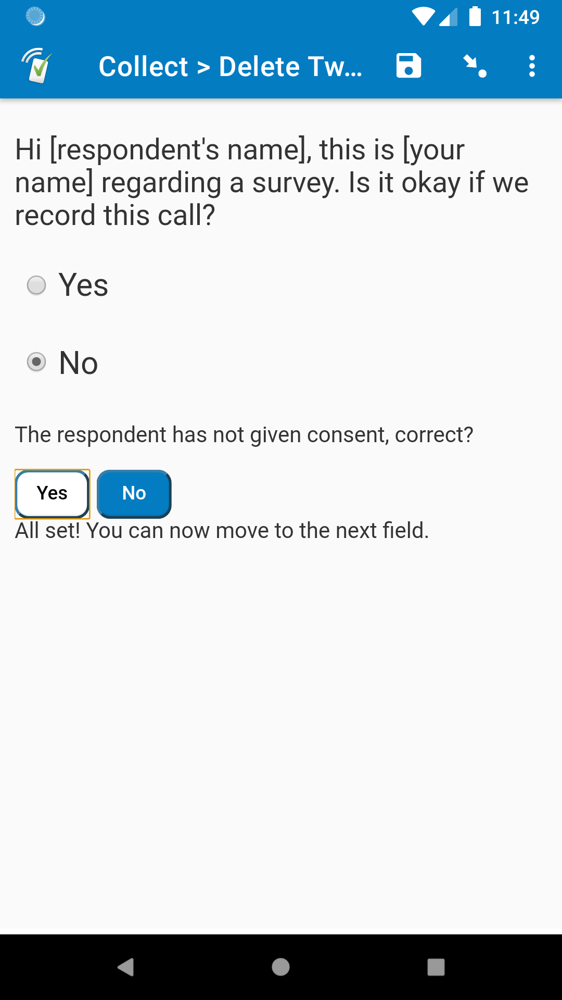
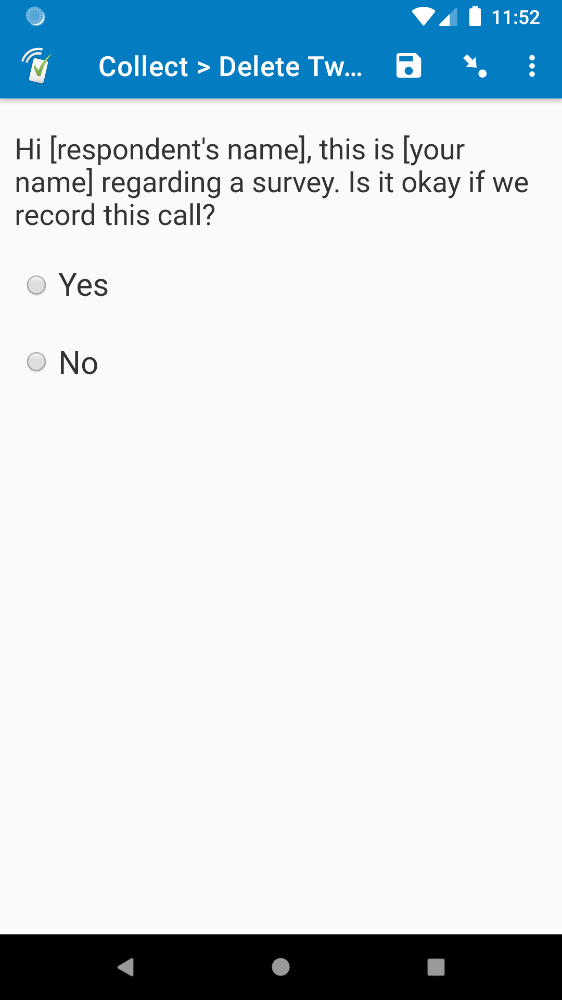
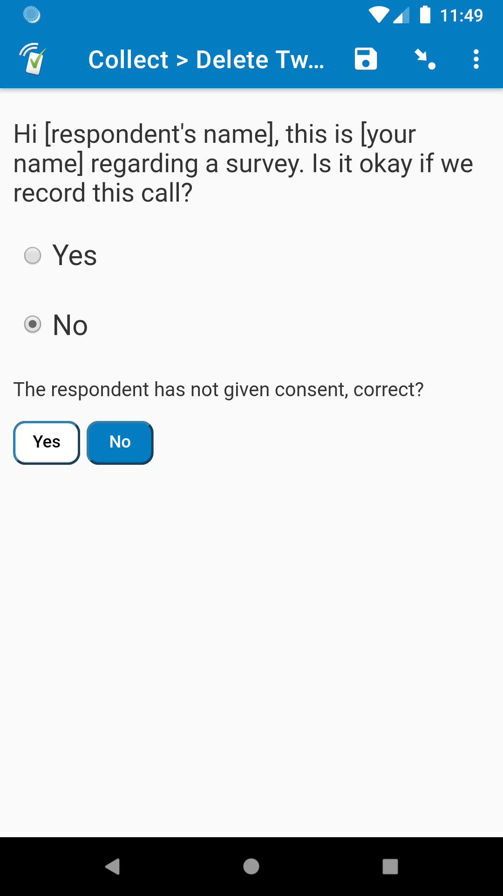
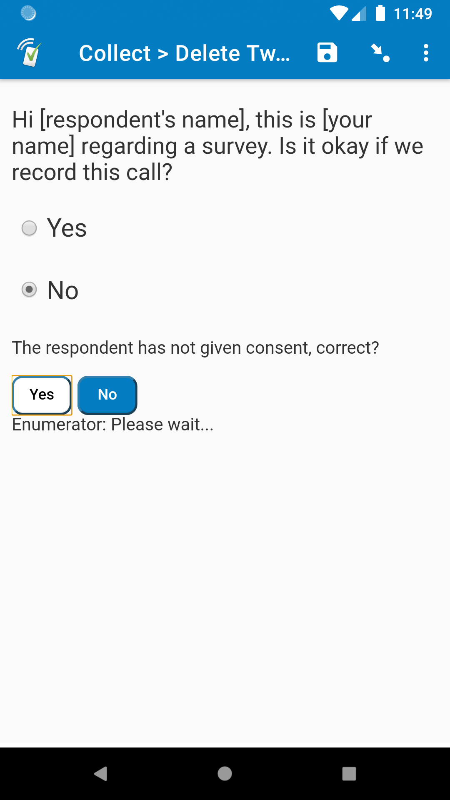

# twilio-control

| Not complete | Confirmation | Working |
| --- | --- | --- |
|  |  |  |

## Description

This is a complement to the [twilio-call](https://github.com/surveycto/twilio-call/blob/master/README.md) field plug-in. For more great Twilio-related resources, check out our support article on [using Twilio in SurveyCTO](https://support.surveycto.com/hc/en-us/articles/360055415333).

This field plug-in can be used to stop, delete, or start a recording for an active Twilio call. This should be attached to a *select_one* field that has a value of `1` if consent is approved, and a value of `0` if consent is denied (the included "yesno" choice list will work well).

### Feature list

* Stop all recordings for a call.
* Stop-and-delete all recordings for a call.
* Start a recording for a call.
* Confirm by the enumerator if consent was approved or denied.
* Pause until action is confirmed. The enumerator will not be able to continue until the action is successfully completed, or when a certain amount of time has passed after confirming the action (see [Timeout](#Timeout) below to learn more).
* Track any issues that may arise, and store the recording URL if it is started.

### Data format

The field value will be simple, since it will have a value of either `1` or `0`, depending on the choice selected. Some data will also be stored in the metadata.

#### Metadata

The metadata will be in two parts, separated by a pipe `|`.

The first part is a success code about whether the action was completed successfully or not:
`0`: The action failed in some way, followed by details of the issue
`1`: The action completed successfully
`2`: No action was taken, because none was needed

This can be important, since if the action failed for some reason, you may want to go into your Twilio console and manually delete the recording. This is rare, but it is important to look out for.

The second part is details about the code. If the code is a `0`, then it will give details about why it failed. If the code is a `1`, and the `action` is 'start' (see [*Parameters*](#parameters) below), then this will be the URL to the recording information.

For example, if the `action` parameter has a value of 'delete', and the recording is successfully deleted, then the metadata will have this value:

    1|All recordings were successfully deleted

## How to use

### Getting started

**Important**: In addition to the required [parameters](#parameters), your choice list should have two choice values: One with a value of `1`, and one with a value of `0`. The choice with a value of `1` is if consent was given, and `0` should be if consent was denied. You can use the basic "yesno" choice list that is included in the form definition template, but you can also define your own choice list if you prefer.

**To use this field plug-in as-is**, just download the [twilio-control.fieldplugin.zip](https://github.com/surveycto/twilio-control/raw/master/twilio-control.fieldplugin.zip) file from this repo, and attach it to your form.

**To use with the sample form:**

1. Download the [sample form](https://github.com/surveycto/twilio-control/raw/master/extras/sample-form/Sample%20form%20-%20Delete%20Twilio%20recording.xlsx) from this repo.
1. Download the [twilio-control.fieldplugin.zip](https://github.com/surveycto/twilio-control/raw/master/twilio-control.fieldplugin.zip) file from this repo.
1. Download the [twilio-call.fieldplugin.zip](https://github.com/surveycto/twilio-call/blob/master/twilio-call.fieldplugin.zip?raw=true) file from the [twilio-call](https://github.com/surveycto/twilio-call/blob/master/README.md) repo.
1. Download the [twilio_access.csv](https://github.com/surveycto/twilio-call/raw/master/extras/sample-form/twilio_access.csv) dataset template (right-click the link, click *Save link as*, set format to *All Files*, add `.csv` to the file name, and save).
1. Update and save the twilio_access.csv file with information about your own Twilio account.
1. Upload the sample form to your server with both field plug-ins and the CSV file attached.
1. Adjust the parameters as you see fit.

### Parameters

| Name | Description |
|:---|:---|
|`action` (required)|What happens when a choice is selected. See [Actions](#actions) below for a list of values you can use.|
|`call_url` (required)|The URL to access the call information. In both this field plug-in's sample form, as well as the twilio-call field plug-in, this is stored in the field called "twilio_call_url"|
|`auth_token` (required)|The authorization token for your Twilio account. (Note: The account SID is not needed, because this is extracted from the `call_url` value.)|
|`timeout` (optional)|How long to wait with no response from Twilio until the enumerator can move on. See [Timeout](#Timeout) below for more information. Takes value in number of seconds.|`8`|
|`waiting_text` (optional)|Message displayed after the consent choice has been confirmed by the enumerator, but a response has not yet been received by the Twilio server.|`'Enumerator: Please wait...'`|
|`complete_text` (optional)|Message displayed when the enumerator can move on to the next field. This means either the action has been completed and a response has been received by the server, or it has timed out.|`'All set! You can now move to the next field.'`|
|`yes` (optional)|Text to display for the "Yes" confirmation button after a choice has been selected.|`'Yes'`|
|`no` (optional)|Text to display for the "No" confirmation button after a choice has been selected.|`'No'`|

#### Actions

These are the values you can give to the `action` parameter. In this table, 'Value' is the value you give to the `action` parameter, and 'Trigger' is the selected choice value that triggers the action. For example, if the `action` parameter has a value of 'delete', then nothing will happen if the choice selected has a value of `1`, only if the choice selected has a value of `0`.

|Value|Trigger|Description|
|:---|:---|:---|
|`'delete'`|`0`|Deletes the recording. If consent is denied, then the recording is stopped, and then deleted.|
|`'stop'`|`0`|Stops the recording only. If consent is denied, then the recording is stopped, but not deleted. That way, you have a recording of the respondent denying consent.|
|`'start'`|`1`|Starts a recording for the active call. If consent is approved, then the call recording starts. Also, the second part of the metadata will store the URL to the call recording information (see [Metadata](#Metadata) above for more information).|

In the sample form, the field "action" on row 26 asks which action should be taken, and this is used for the `action` parameter of the field plug-in. For actual data collection, this will be explicitly stated, like this: `action='deleted'`

#### Timeout

In this field plug-in, the enumerator cannot move on from the field until it has been confirmed that the action is complete (e.g. the recording has been deleted, the recording has been stopped, etc). While this should just take a second or two, in places with slower internet connections, this can take longer. By default, if there is no response within `8` seconds, then the field plug-in will allow the enumerator to move forward. This does not mean the action failed, just that the enumerator should just move on and complete the form so they don't keep the respondent waiting.

If 8 seconds is too long or too short, you can use the `timeout` parameter to adjust it. For example, `timeout=5` shortens the timeout time to 5 seconds.

### Default SurveyCTO feature support

| Feature / Property | Support |
| --- | --- |
| Supported field type(s) | `select_one` |
| Default values | No |
| Custom constraint message | No |
| Custom required message | No |
| Read only | Yes |
| media:image | Yes |
| media:audio | Yes |
| media:video | Yes |
| `label` appearance | No |
| `list-nolabel` appearance | No |
| `quick` appearance | No |
| `minimal` appearance | Yes |
| `compact` appearance | No |
| `compact-#` appearance | No |
| `quickcompact` appearance | No |
| `quickcompact-#` appearance | No |
| `likert` appearance | No |
| `likert-min` appearance | No  |
| `likert-mid` appearance | No |

## More resources

* **Sample form**  
You can find a form definition in this repo here: [extras/sample-form](extras/sample-form). You will also need the [twilio-call](https://github.com/surveycto/twilio-call/blob/master/README.md) field plug-in, as well as its [twilio_access.csv file](https://github.com/surveycto/twilio-call/blob/master/extras/sample-form/twilio_access.csv), which you can learn more about in its documentation.

* **Developer documentation**  
More instructions for developing and using field plug-ins can be found here: [https://github.com/surveycto/Field-plug-in-resources](https://github.com/surveycto/Field-plug-in-resources)
